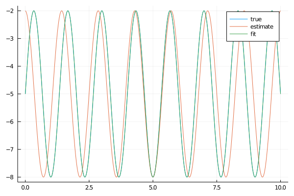

# SineFit.jl

[Documentation](https://juliahub.com/docs/SineFit/)

This package provides functions for estimating and accurately fitting a sine
function to a given signal.

This is basically an improvement in robustness to only using `LsqFit`: clever
initial parameter guessing helps the least-squares fit converge quickly and
accurately.

## Why?

Fitting a periodic function using FFT only doesn't always produce the correct frequency,
as a discrete Fourier transform has a discrete frequency resolution and thus
doesn't produce the correct frequency for all input data sets.

Fitting a periodic function using LsqFit only doesn't always converge properly,
as there is e.g. not a unique phase shift fit parameter.

Combining the two approaches, using an FFT to guess the initial fit parameters
and then using a least-squares function fit, produces accurate results most of
the time.
